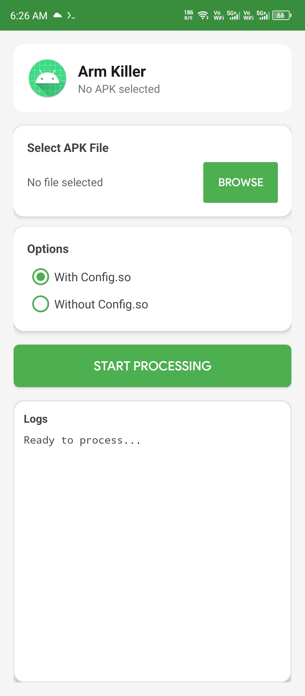
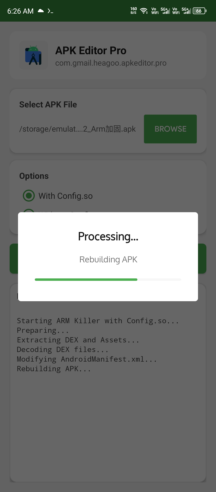

# ArmKiller

> Strip ARM protection from Android APKs. Clean, fast, no root required.

---

## Download

> [!NOTE]
Download the latest version directly from GitHub Releases:  
**[⬇️ Get ArmKiller](https://github.com/Anon4You/ArmKiller-app/releases)**

---

## Capabilities

- **Protection Removal:** Strips ARM-based stubs and obfuscation layers
- **Dual Mode:** Handles both `config.so` and standard ARM schemes
- **DEX Decryption:** Automatically XOR-decodes encrypted DEX files
- **Manifest Repair:** Restores the real application entry point
- **Auto-Signing:** Rebuilds and signs the output APK instantly
- **Live Logging:** Real-time terminal output directly in the UI

---

## Pipeline

> [!NOTE]
**Input:** `app.apk` ➔ **Output:** `app.kill.apk`

`Extract Assets` ➔ `Decode DEX (XOR)` ➔ `Patch Manifest` ➔ `Rebuild & Sign`

---

## Screenshots

<table>
  <tr>
    <td></td>
    <td></td>
  </tr>
</table>

---

## Usage

1. Install ArmKiller and grant **Storage** and **All Files Access** permissions.
2. Tap **Browse** and select the protected APK.
3. Select the processing mode (*With* or *Without config.so*).
4. Tap **Start Processing** and monitor the live logs.
5. Locate your processed `.kill.apk` at the path shown in the output.

---

> [!WARNING]
**Disclaimer:** This tool is strictly intended for educational purposes, security research, and authorized reverse engineering only. Do not use for piracy or copyright infringement. The developers assume no liability for misuse.